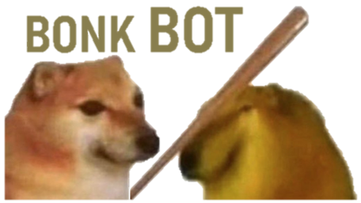

# BonkBot

    

    
    
    
    
    

Este bot para o Discord foi criado para divertir os meus amigos no primeiro de abril de 2020.

# :star: Sumário

* [Descrição](#descrição)
* [Invite do bot](#invite-do-bot) 
* [Achou algum bug?](#problemas)
* [Licença](#licença)

# Descrição
A única função do BonkBot, é você mencionar uma pessoa no Discord para receber um "BONK!".

# Invite do bot
Você pode convidar o BonkBot para o seu servidor [clicando aqui.](https://discord.com/oauth2/authorize?client_id=695322447943172106&permissions=109568&scope=bot)

# Problemas
Se você encontrou algum bug, se sinta livre **para criar uma nova issue**  [clicando aqui!](https://github.com/TheeDouglasAM3/BonkBot/issues). Se você já encontrou a solução para o problema, **faça um pull request**!

# Licença

Criado em 2020 

Feito com carinho por [Douglas Alves Marcelino](https://github.com/TheeDouglasAM3) :duck:

Esse projeto esta sobre [MIT license](./LICENSE). BONK!